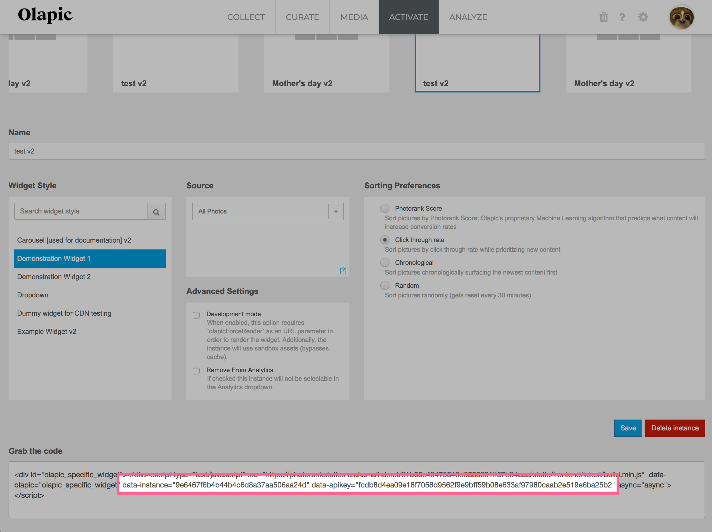
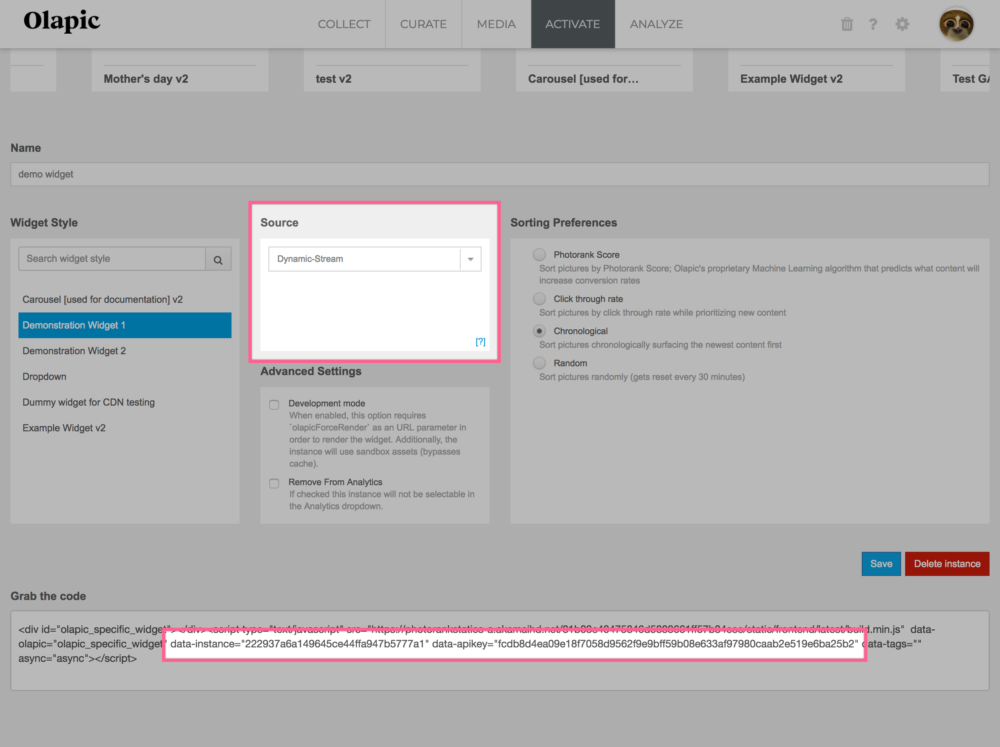

## Overview
There are two pre-confiugred Olapic tags that are currently available in Tealium's Tag Library:

* Olapic Checkout Pixel Tag
* Olapic Widget Instance Tag
  * Static Widget
  * Dynamic Widget (Stream or Category)

This article covers the configuration steps for the above tag types.

## Widget Instance Tag

### Static Widget Configuration

The following step-by-step will walk you through the necessarys steps required to configure a **static** type widget (i.e., widget showing content from a specific stream or category, or using the "All Photos" setting in the Olapic Widget Manager).

1. First, search for the Olapic tags in the Tags tab in the Tealium TMS, click the "+ Add" button next to the Olapic Widget Instance:

    

2. Fill in the fields under the Vendor configuration section. 

    

    The `API Key`, `Widget Instance ID` values can be found within the Olapic widget code generated in the Widget Manager section within the Olapic admin (refer to the second screenshot below).

    

    

      <h4>Container div element must exist</h4>
      The container div with a specific ID that will hold the Olapic widget content is required in the DOM. If the element is not present on the the source level, use the <a href="https://community.tealiumiq.com/t5/iQ-Tag-Management/Content-Modification-Extension/ta-p/12194>"><strong>Tealium Content Modification extension</strong></a> to inject the element dynamically.
    

3. Set the appopriate Load Rules for the tag:

    

4. *Optional* –  Data Mapping. You can use the Data Mapping to load the widget using the Development Mode flag. For more details around the Development Mode, please see [Technical Overview of the Activate Tab](https://olapic1.zendesk.com/hc/en-us/articles/218238663-Technical-Overview-of-the-Activate-Tab#Development-Mode).

    

5. Save and publish the changes to the tag in the appropriate profile. Once published, check the site page that matches the load rule to ensure the widget is loading correctly.

    

### Dynamic Widget Configuration

The following step-by-step will walk you through the necessarys steps required to configure a **dynamic** type widget (i.e., widget showing content from a specific product stream or product category depending on key value passed on a category or product level page)

1. First, search for the Olapic tags in the Tags tab in the Tealium TMS, click the "+ Add" button next to the Olapic Widget Instance:

    

2. Fill in the fields under the Vendor configuration section. 

    

    The `API Key`, `Widget Instance ID` values can be found within the Olapic widget code generated in the Widget Manager section within the Olapic admin (refer to the second screenshot below).

    

    

      <h4>Ensure that the Widget Source set to Dynamic</h4>
      Be sure to use "Dynamic-Stream" or "Dynamic-Category" when setting up a dynamic widget.
    

    

      <h4>Container div element must exist</h4>
      The container div with a specific ID that will hold the Olapic widget content is required in the DOM. If the element is not present on the the source level, use the <a href="https://community.tealiumiq.com/t5/iQ-Tag-Management/Content-Modification-Extension/ta-p/12194>"><strong>Tealium Content Modification extension</strong></a> to inject the element dynamically.
    

3. Set the appopriate Load Rules for the tag:

    

4. Set up the appropriate Data Mapping. You can use the Data Mapping to load the widget using a specific . For more details around the Development Mode, please see [Technical Overview of the Activate Tab](https://olapic1.zendesk.com/hc/en-us/articles/218238663-Technical-Overview-of-the-Activate-Tab#Development-Mode).

    

5. Save and publish the changes to the tag in the appropriate profile. Once published, check the site page that matches the load rule to ensure the widget is loading correctly.

    

