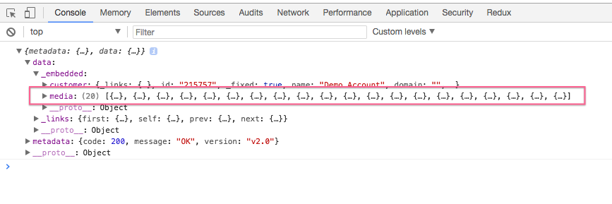
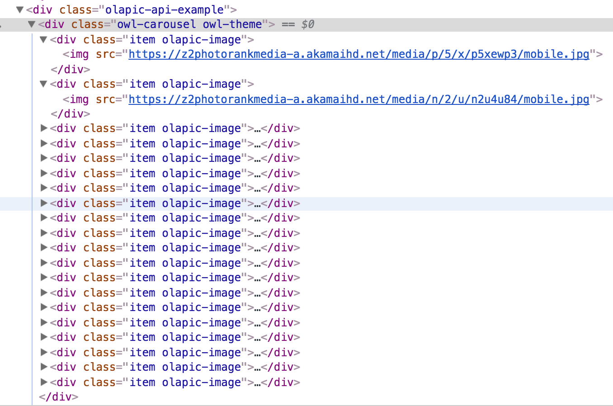

## Table of Contents

- [Overview](#overview)
- [Authentication](#authentication)
- [Into The Code](#into-the-code)
	- [HTML](#html)
	- [JavaScript](#javascript)
- [Finished Carousel](#finished-carousel-with-olapic-ugc)

## Overview

For this tutorial, we will be creating a simple Javascript carousel using Olapic APIv2 to display the most recently published content. 

For the full technical specs for APIv2, please refer to the [APIv2 documentation](http://apiv2-docs.photorank.me/index.html).

#### Full Code

You can view the full code for this tutorial [here](https://github.com/Olapic/PublicDocs/tree/gh-pages/code_examples/apiv2-carousel).

#### Working UGC Carousel Example

Click the navigation arrows to interact with the widget.

<iframe width="1000" height="350" src="/code_examples/apiv2-carousel/" frameborder="0" allowfullscreen></iframe>

## Authentication

### API Key

1. In order to make valid API calls, you will need your Olapic API Key.
  
    You can find your API Key in the Olapic Platform by clicking the Settings icon in the top right corner:

    

    Copy the API key by clicking the `COPY` button:

    {:width="600px"}

### Customer ID

1. You can hit our root endpoint using your API Key to return the `Customer` object associated with the API key. 

    For more information on the `Customer` object, please refer to the [Customer Endpoints](http://apiv2-docs.photorank.me/#customer-endpoints) in our APIv2 documentation.

    Example request:

    `GET https://photorankapi-a.akamaihd.net/auth_token={api_key}&version=2.2`

    Example response:

        {
          metadata: {
          code: 200,
          message: "OK",
          version: "v2.0"
          }, 
          data: {
            _links: {
              self: {
                href: "//photorankapi-a.akamaihd.net/?auth_token=0a40a13fd9d531110b4d6515ef0d6c529acdb59e81194132356a1b8903790c18&version=v2.2"
              }
            },
            _fixed: true,
            _embedded: {
              customer: {
                _links: {
                  self: {
                    href: "//photorankapi-a.akamaihd.net/customers/215757?auth_token=0a40a13fd9d531110b4d6515ef0d6c529acdb59e81194132356a1b8903790c18&version=v2.2"
                  }
                },
                id: "215757",
                _fixed: true,
                name: "Demo Account",
                domain: "",
                template_dir: "demo",
                language: "en_US",
        ...

## Into The Code

Let's start setting up our code by creating our HTML, CSS and JS files.

For this exercise, we will be using jQuery to handle the AJAX call to the Olapic API and OwlCarousel to handle the carousel functionality.

- [jQuery from Google CDN](https://developers.google.com/speed/libraries/#jquery)
- [OwlCarousel Plugin](https://owlcarousel2.github.io/OwlCarousel2/)

### HTML

We'll create an index.html page that will contain all of our HTML. Our `<head>` section will contain links to our stylesheets, JS files and any dependencies. Here is what it looks like so far:

```html
<head>

  <meta name="viewport" content="width=device-width, initial-scale=1.0">

  <title>Olapic API Examples</title>

  <!-- CSS -->
  <link rel="stylesheet" type="text/css" href="css/owl.carousel.min.css">
  <link rel="stylesheet" type="text/css" href="css/owl.theme.default.min.css">
  <link rel="stylesheet" type="text/css" href="css/main.css">

  <!-- jQuery -->
  <script src="https://ajax.googleapis.com/ajax/libs/jquery/3.3.1/jquery.min.js"></script>

  <!-- Owl Carousel JS-->
  <script src="js/owl.carousel.min.js"></script>

  <!-- main JS -->
  <script src="js/main.js"></script>

</head>
```

The `<body>` section will be simple since we will be adding HTML via JavaScript. We will create two `<div>` containers. One as a parent container and one as a requirement for OwlCarousel to target.

```html
<body>

  <div class="olapic-api-example">
    <div class="owl-carousel owl-theme"></div>
  </div>

</body>
```

The final HTML code should look like:

```html
<!DOCTYPE html>
<html>
<head>
  <meta name="viewport" content="width=device-width, initial-scale=1.0">

  <title>Olapic API Examples</title>

  <!-- CSS -->
  <link rel="stylesheet" type="text/css" href="css/owl.carousel.min.css">
  <link rel="stylesheet" type="text/css" href="css/owl.theme.default.min.css">
  <link rel="stylesheet" type="text/css" href="css/main.css">

  <!-- jQuery -->
  <script src="https://code.jquery.com/jquery-3.2.1.min.js" integrity="sha256-hwg4gsxgFZhOsEEamdOYGBf13FyQuiTwlAQgxVSNgt4=" crossorigin="anonymous"></script>

  <!-- Owl Carousel JS-->
  <script src="js/owl.carousel.min.js"></script>

  <!-- main JS -->
  <script src="js/api_examples.js"></script>

</head>
<body>

  <div class="olapic-api-example">
    <div class="owl-carousel owl-theme"></div>
  </div>

</body>
</html>
```

### JavaScript

We'll need to create a `main.js` file that contains our JavaScript. This is linked to the `index.html` that will display our carousel. 

To make sure our JavaScript code is executed once the DOM is ready, we'll use the `$(document).ready()` function:

```js
$(document).ready(function(){
	
});
```

Inside this function is where we'll execute the code that makes a call to the Olapic API and retreives the most recent content and displays it in the Carousel.

Before we construct the AJAX call, we'll create a variable that will store the URL we want to call. Since the goal of this tutorial is to display the most recent images, we'll be making a call to the [Get Media of a Customer](http://apiv2-docs.photorank.me/index.html#media-endpoints-get-media-of-a-customer) endpoint.

The HTTP Request for this endpoint looks like:

```plain
GET /customers/{customer_id}/media/{sorting_option}?rights_given={rights_given}&include_tagged_galleries={include_tagged_galleries}
Host: photorankapi-a.akamaihd.net
```

See all required/optional parameters and their definitions of the endpoint [here](http://apiv2-docs.photorank.me/index.html#media-endpoints-get-media-of-a-customer).

Now that we understand all the parameteres available for this endpoint, we'll construct our request:

```
var olapicEndpoint = "https://photorankapi-a.akamaihd.net/customers/215757/media/recent?rights_given=0&include_tagged_galleries=0&auth_token=0a40a13fd9d531110b4d6515ef0d6c529acdb59e81194132356a1b8903790c18&version=v2.2";
```

Looking at the endpoint, we're calling on the most recent media of customer `215757`, sorted by `recent` order, and no need to have media rights (`rights_given=0`). We've also specified to remove any streams with the status `TAG` from the embedded object in the response (`include_tagged_galleries=0`).

#### AJAX

Now let’s construct our AJAX call to this endpoint and see what the response looks like. For now, we’ll log the response in the console so that we know what to traverse when we start to extract data.

Here is what we have so far:


```js
$(document).ready(function() {
  var olapicEndpoint = "https://photorankapi-a.akamaihd.net/customers/215757/media/recent?rights_given=0&include_tagged_galleries=0&auth_token=0a40a13fd9d531110b4d6515ef0d6c529acdb59e81194132356a1b8903790c18&version=v2.2";

  $.ajax({
    dataType: "json",
    url: olapicEndpoint,
    type: "GET",
    data: {
      format: "json"
    },
    success: function(data) {
      console.log(data);
    },
    error: function(error){
      console.log(error);
    }
  });
});
```


We’re making a GET request to this endpoint and expecting to receive a response in JSON format. If the response is returned successfully, we’ll log the response to the console. If there’s an error, we’ll log the error to the console. 

**Console:** 

{:width="700px"}

After traversing the response, we see the media array lives under `data._embedded.media`. Let’s capture the array in a variable called `mediaArray` so that we can iterate through the array.

```js
$.ajax({
  dataType: "json",
  url: olapicEndpoint,
  type: "GET",
  data: {
    format: "json"
  },
  success: function(data) {
    var mediaArray = data.data_embedded.media;
    console.log(mediaArray);
  },
  error: function(error){
    console.log(error);
  }
});
```

If we log the `mediaArray` to the console, we should see the array of media objects:

{:width="700px"}

We’ll want to iterate through this to grab the URL of the media so that we can display it in the carousel. 

Let’s look at first media object to see where we can find the URL hosting the image.

{:width="700px"}

Looking at the first media object, we see the images object property contains five different versions of the asset. Here are the specifications of each version of the asset:

- **Square:** 90x90px image. Cropped, does not maintain original ratio.
- **Thumbnail:** 150x150px image. Maintains original ratio.
- **Mobile:** 320x320px image. Maintains original ratio.
- **Normal:** 640x640px image. Maintains original ratio.
- **Original:** original image without modifications.

Now that we know where in the media object to get the image URL, we will construct a FOR loop that will loop through `mediaArray`. Each time it hits a media object in the array we’ll store the mobile image asset in a variable and append HTML inside the owl-carousel `<div>`.

```js
for (x=0; x < mediaArray.length; x++) {
  var mediaItem = mediaArray[x];
  console.log(mediaItem);

  var olapicImage = mediaItem.images.mobile;
  $(".owl-carousel").append("<div class='item olapic-image'></div>");
};
```

The end result is 20 additional `<div>` containers with `` tags appended inside the owl-carousel `<div>`.

{:width="500px"}

We now know it’s working so we can move on to setting up the carousel.

#### Carousel

For the carousel, we'll use a nifty image carousel plugin called OwlCarousel. 

To configure OwlCarousel, refer to their [documentation](https://owlcarousel2.github.io/OwlCarousel2/docs/started-installation.html) and available [options](https://owlcarousel2.github.io/OwlCarousel2/docs/api-options.html) from their API.

The basic setup requires us to use their CSS, JS and jQuery:

```html
<link rel="stylesheet" href="owlcarousel/owl.carousel.min.css">
<script src="owlcarousel/owl.carousel.min.js"></script>
```

Looking back at our HTML example in the beginning of this tutorial, you'll notice that these files are already included.

We already have a container for owlCarousel to inject the content, so all we need to do is invoke the plugin:

```js
$(".owl-carousel").owlCarousel();
```

Utilizing a few of the OwlCarousel API options, the implementation looks like:

```js
$(".owl-carousel").owlCarousel({
  items: 4,
  loop: true,
  touchDrag: true,
  nav: true,
  navText: ["<i class='arrow left'></i>", "<i class='arrow right'></i>"],
  dots: false,
  video: true,
  responsive: {
    0: {
      items:1,
      center:true
    },
    414: {
      items: 2
    },
    550: {
      items:3
    },
    1000: {
      items:4
    }
  }
});
```

Your final code should look like:

**`index.html`:**

```html
<!DOCTYPE html>
<html>
<head>
  <meta name="viewport" content="width=device-width, initial-scale=1.0">

  <title>Olapic API Examples</title>

  <!-- CSS -->
  <link rel="stylesheet" type="text/css" href="css/owl.carousel.min.css">
  <link rel="stylesheet" type="text/css" href="css/owl.theme.default.min.css">
  <link rel="stylesheet" type="text/css" href="css/main.css">

  <!-- jQuery -->
  <script src="https://code.jquery.com/jquery-3.2.1.min.js" integrity="sha256-hwg4gsxgFZhOsEEamdOYGBf13FyQuiTwlAQgxVSNgt4=" crossorigin="anonymous"></script>

  <!-- Owl Carousel JS-->
  <script src="js/owl.carousel.min.js"></script>

  <!-- main JS -->
  <script src="js/api_examples.js"></script>

</head>
<body>
  <div class="olapic-api-example">
    <div class="owl-carousel owl-theme"></div>
  </div>
</body>
</html>
```

**`js/script.js`:**

```js
$(document).ready(function() {

  /******** Homepage Carousel - All Photos *********/
  var olapicEndpoint = "https://photorankapi-a.akamaihd.net/customers/215757/media/recent?rights_given=0&include_tagged_galleries=0&auth_token=0a40a13fd9d531110b4d6515ef0d6c529acdb59e81194132356a1b8903790c18&version=v2.2";

  $.ajax({
    dataType: "json",
    url: olapicEndpoint,
    type: "GET",
    data: {
      format: "json"
    },
    success: function(data) {      
      var mediaArray = data.data._embedded.media;

      // Loop through the mediaArray
      for (x=0; x < mediaArray.length; x++) {
        var mediaItem = mediaArray[x];
        var olapicImage = mediaItem.images.mobile;

        $(".owl-carousel").append("<div class='item olapic-image'></div>");
      };

      // Set up Owl Carousel
      $(".owl-carousel").owlCarousel({
        items: 4,
        loop: true,
        touchDrag: true,
        nav: true,
        navText: ["<i class='arrow left'></i>", "<i class='arrow right'></i>"],
        dots: false,
        video: true,
        slideBy: 'page',
        navSpeed: 150,
        autoplay: true,
        autoplayTimeout: 2000,
        autoplaySpeed: 150,
        responsive: {
          0: {
            items:1,
            center:true
          },
          414: {
            items: 2
          },
          550: {
            items:3
          },
          1000: {
            items:4
          }
        }
      });
    },
    error: function(error){
      console.log(error);
    }
  });
});
```


And that’s it! You now have a working Image Carousel that is streaming your Olapic UGC.

{:width="700px"}

With some additional CSS, you can style the carousel as you please to match your brand design guidelines. 
