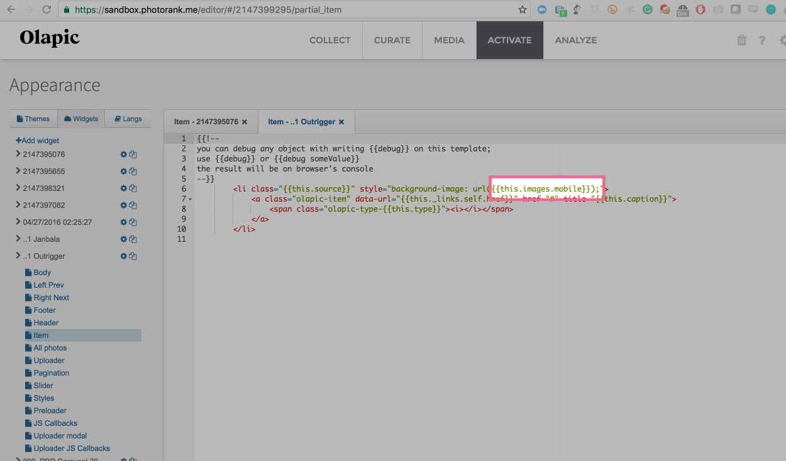
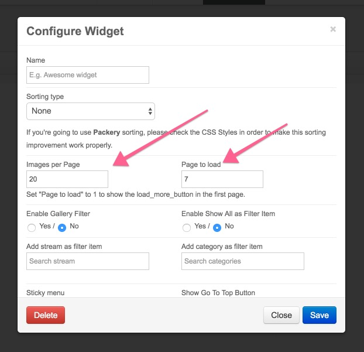

The following document will cover the optimization techniques in regards to the Olapic Javascript Widget implementation.

## Table of Contents

- [Overview](#overview)
- [Load Sequence Control](#load-sequence-control)
  - [Example 1 - Moving the `
    

    <!-- Olapic script will not load until script A and script B are done loading -->
    

    <!-- When Olapic script starts to load, it will not block the browser from initiating load for script C -->
    
</body>
</html>


**Note:** Please beware that moving the Olapic script lower on the page may result in a delayed "pop-in" effect depending on the speed of the prioritized assets being loaded on the page.

### Example 2 - Using the SDK Load Method 
The Olapic SDK Load method gives you the ability to programmatically invoke the widget load on demand (i.e., `$(document).ready()`).

Please refer to our detailed step-by-step technical guide: [https://olapic1.zendesk.com/hc/en-us/articles/203456360-SDK-Widget-Load-Method](https://olapic1.zendesk.com/hc/en-us/articles/203456360-SDK-Widget-Load-Method).

## Use Appropriate Image Size
Our API provides different versions of the static image assets for you to pick and choose from. Choosing the right image size for different contexts can be a night and day difference.

Please refer to the the **Media Sizing Options** section of our API documentation for more details on the different available assets we provide: [http://apiv2-docs.photorank.me/#header-media-sizing-options](http://apiv2-docs.photorank.me/#header-media-sizing-options)

You can also use different image sizing in the template editor as well:

## Lazy Loading Image Assets
With the Carousel widgets, you can implement custom logic to only load the photos within the user's viewport.

You will find below the sample code to implement the lazy-load functionality for the Olapic Carousel widget. Please make sure to make minor adjustments to the `JS Callbacks` and `Item` templates depending on your existing markup.

**JS Callbacks:**


<script type="text/javascript">
var OlapicCallback = OlapicCallback || {};
OlapicCallback.olapicSliderAfterRender = function(w){
    var $self = oQuery('#' + w.wrapperId);
    var firstLoad = Math.ceil(window.screen.availWidth / 277) + 1;
    
    oQuery('.olapic-carousel .olapic-item', $self).each(function(i, val) { 
        if (i < firstLoad) {
            oQuery(this).css('background-image','url(' + oQuery(this).attr('data-image') + ')').data( 'loaded' , '1' );
        }
    });
    oQuery('.olapic-nav-button', $self).click(function() {
        var $previous = oQuery('.olapic-carousel .olapic-item', $self).filter(function() { 
            return oQuery(this).data('loaded') != true 
        });
        
        if ( oQuery(this).hasClass('olapic-nav-next') ) {
            $previous.first().css('background-image','url(' + $previous.first().attr('data-image') + ')').data('loaded','1');
        } else {
            $previous.last().css('background-image','url(' + $previous.last().attr('data-image') + ')').data('loaded','1');
        }
    });
};
</{{!}}script>


**Item:**


<li class="{{this.source}}">
  <a href="#" class="olapic-item" data-url="{{this._links.self.href}}" title="{{this.caption}}" data-image="{{this.images.mobile}}">
    <i></i>
  </a>
</li>


## Configure Number of Photos
You can optimize the number of photos that initially loads for widgets depending on the use case. 

You can configure this in the respective Widget Configurations:

